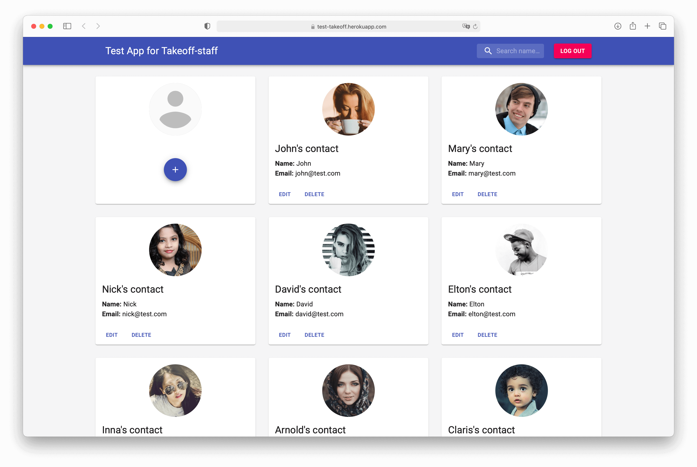

# Тестовое задание для Takeoff-staff

Небольшое SPA из двух экранов - логина и списка контактов. 
Список контактов доступен только после авторизации.
Функционал экрана контактов: добавление, удаление и редактирование контактов, поиск по имени контакта.

---

Опубликованная версия доступна по ссылке - https://test-takeoff.herokuapp.com

---

## Технологии
 - React
 - Redux
 - Material UI
 - My JSON Server

---

## Замечания

Из-за специфики работы My JSON Server все отправляемые запросы на сервер не изменяют данные, поэтому
преобразование данных происходит на клиенте после успешного ответа сервера.

---

## Превью

---
### Инструкции:
1. Клонируйте репозиторий на локальную машину:
~~~
git clone git@github.com:pestrige/test-takeoff.git
~~~
2. Перейдите в папку проекта:
~~~
cd test-takeoff
~~~
4. Установите зависимости:
~~~
npm install
~~~
5. Запустите проект командой:
~~~
npm start
~~~
